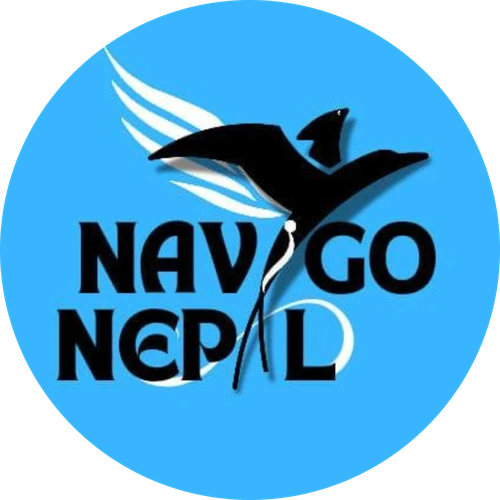

# Navigo Nepal — Master Homepage UI Design System & Replication Guide

> **Official Design Blueprint & UI Specification**  
> Use this document to replicate the exact homepage look, color palette, typography hierarchy, component structures, interactive elements, and micro-animations across all existing pages (e.g., `discord-workshop.html`, `programs.html`, `past-events.html`, `team.html`, `our-story.html`) and all future upgrades.

---

## Table of Contents
1. [Design Philosophy & Aesthetic DNA](#1-design-philosophy--aesthetic-dna)
2. [Color Palette & Dual-Theme System](#2-color-palette--dual-theme-system)
3. [Typography Hierarchy & Google Fonts](#3-typography-hierarchy--google-fonts)
4. [Atmosphere: Backgrounds, Glows & Patterns](#4-atmosphere-backgrounds-glows--patterns)
5. [Layout Rhythm & Section Structure](#5-layout-rhythm--section-structure)
6. [Signature UI Components (Ready-to-Copy Snippets)](#6-signature-ui-components-ready-to-copy-snippets)
   - [6.1 Sticky Frosted Glass Navbar](#61-sticky-frosted-glass-navbar)
   - [6.2 Editorial Hero Section](#62-editorial-hero-section)
   - [6.3 Infinite Marquee Ticker Banner](#63-infinite-marquee-ticker-banner)
   - [6.4 Multi-Segment Grassroots Accent Bars](#64-multi-segment-grassroots-accent-bars)
   - [6.5 Bebas Neue Grassroots Section Headers](#65-bebas-neue-grassroots-section-headers)
   - [6.6 Challenge & Response Numbered Arrow Cards](#66-challenge--response-numbered-arrow-cards)
   - [6.7 Team & Coordinator Grid Cards](#67-team--coordinator-grid-cards)
   - [6.8 Interactive Filter Tabs & Data Tables](#68-interactive-filter-tabs--data-tables)
   - [6.9 Horizontal Metrics & Stats Bar](#69-horizontal-metrics--stats-bar)
   - [6.10 Editorial Quote & Video Embed Block](#610-editorial-quote--video-embed-block)
   - [6.11 Glassmorphism Panels & Hover Cards](#611-glassmorphism-panels--hover-cards)
   - [6.12 Partner & Sponsor Logo Grid](#612-partner--sponsor-logo-grid)
   - [6.13 Universal Premium 4-Column Footer](#613-universal-premium-4-column-footer)
   - [6.14 Form Controls, QR Donation & Modals](#614-form-controls-qr-donation--modals)
7. [Button & CTA System](#7-button--cta-system)
8. [Core Micro-Interactions & JavaScript Hooks](#8-core-micro-interactions--javascript-hooks)
9. [Step-by-Step Checklist: How to Replicate Homepage UI on Any Page](#9-step-by-step-checklist-how-to-replicate-homepage-ui-on-any-page)
10. [Quick Implementation: Upgrading `discord-workshop.html`](#10-quick-implementation-upgrading-discord-workshophtml)

---

## 1. Design Philosophy & Aesthetic DNA

Navigo Nepal's homepage features a **high-impact, international-grade editorial aesthetic** inspired by leading global non-profit and innovation platforms (UNESCO, UNICEF, Gates Foundation, TED):

* **High-Contrast Editorial Contrast**: Bold, dark sections (`#0A0A0A`, `#06172F`, `#0b1f3a`) punctuated with pure white text and vibrant brand accents.
* **Grassroots Vibrancy**: Distinct multi-color segment accent bars (Red, Amber/Yellow, Green, Blue) celebrating diversity and grassroots energy.
* **Sharp, Modern Geometry**: Deliberate mix of sharp `0px` border-radius elements (hero CTAs, filter tabs, numbered cards) and subtle rounded corners (`8px` to `12px` on standard buttons and panels).
* **Atmospheric Depth**: Floating ambient light orbs (`blur(120px)`), subtle dot/grid backdrops, and frosted glass (`backdrop-filter: blur(20px)`).
* **Dual-Theme Seamlessness**: Light mode default with full `data-theme="dark"` support saved in `localStorage`.

---

## 2. Color Palette & Dual-Theme System

### 2.1 Core Hex Codes

| Color Token | Hex Code | RGB | Purpose & Usage |
| :--- | :--- | :--- | :--- |
| **Primary Navy** | `#0A2342` | `rgb(10, 35, 66)` | Light mode headings, dark hero headers, secondary text |
| **Deep Navy (Dark Base)** | `#06172F` | `rgb(6, 23, 47)` | Dark mode body background, dark section base |
| **Section Alt Navy** | `#0b1f3a` | `rgb(11, 31, 58)` | Alternating navy section background |
| **Elite Blue (Primary)** | `#2563EB` | `rgb(37, 99, 235)` | Primary buttons, active state, accent line segment |
| **Luxury Blue (Glow/Hover)**| `#4F9CF9` | `rgb(79, 156, 249)`| Gradient endpoints, dark mode link highlights |
| **Soft Sky** | `#DCEEFF` | `rgb(220, 238, 255)`| Light mode hover backgrounds, subtle glow tint |
| **Emerald Green** | `#10B981` | `rgb(16, 185, 129)`| Success badges, green accent bar segment |
| **Teal Accent** | `#2A9D8F` | `rgb(42, 157, 143)`| Navbar active underline, green hero CTA button |
| **Warm Amber / Yellow** | `#F4A261` | `rgb(244, 162, 97)`| Section title highlights, yellow CTA button, badge border |
| **Badge Orange** | `#E87A24` | `rgb(232, 122, 36)`| Challenge/Response numbered badges & highlight tags |
| **Grassroots Crimson Red** | `#DC2626` / `#E63946` | `rgb(220, 38, 38)` | Red accent bar segment, map hover fill |
| **Luxury Background (Light)**| `#F8FBFF` | `rgb(248, 251, 255)`| Default body background in light mode |
| **Pure White** | `#FFFFFF` | `rgb(255, 255, 255)`| Dark mode text, card surfaces in light mode |
| **Muted Slate Gray** | `#64748B` | `rgb(100, 116, 139)`| Subtitles, body descriptions, table headers |

---

### 2.2 Root CSS Variables (`:root` & `[data-theme="dark"]`)

All colors and spacing are managed via CSS variables in `css/style.css`:

```css
:root {
  /* Core Brand Colors */
  --primary-navy: #0A2342;
  --deep-navy: #06172F;
  --luxury-blue: #4F9CF9;
  --soft-sky: #DCEEFF;
  --elite-blue: #2563EB;
  --emerald: #10B981;
  --pure-white: #FFFFFF;
  --luxury-bg: #F8FBFF;
  --soft-gray: #64748B;

  /* Semantic Variables (Light Mode Default) */
  --bg-primary: #F8FBFF;
  --bg-secondary: #FFFFFF;
  --bg-card: #FFFFFF;
  --bg-navbar: rgba(255, 255, 255, 0.92);
  --border-color: rgba(10, 35, 66, 0.08);
  --border-glass: rgba(79, 156, 249, 0.15);

  --text-main: #0A2342;
  --text-muted: #64748B;
  --text-inverse: #FFFFFF;

  --accent-color: #2563EB;
  --accent-light: #4F9CF9;
  --accent-emerald: #10B981;
  --secondary-color: #0A2342;

  --gradient-primary: linear-gradient(135deg, #2563EB 0%, #4F9CF9 100%);
  --gradient-hero: linear-gradient(135deg, #0A2342 0%, #1a3a5c 50%, #06172F 100%);
  --gradient-accent: #2563EB;
  --gradient-card: linear-gradient(180deg, rgba(37, 99, 235, 0.03) 0%, rgba(10, 35, 66, 0.03) 100%);

  --glow-1: rgba(79, 156, 249, 0.08);
  --glow-2: rgba(37, 99, 235, 0.05);
  --shadow-sm: 0 1px 3px rgba(10, 35, 66, 0.06);
  --shadow-md: 0 4px 20px rgba(10, 35, 66, 0.08);
  --shadow-lg: 0 12px 40px rgba(10, 35, 66, 0.1);
  --shadow-xl: 0 25px 60px rgba(10, 35, 66, 0.12);

  --radius-sm: 4px;
  --radius-md: 8px;
  --radius-lg: 12px;
  --radius-xl: 16px;
  --radius-full: 9999px;
}

[data-theme="dark"] {
  --bg-primary: #06172F;
  --bg-secondary: #0A2342;
  --bg-card: #0d2a4a;
  --bg-navbar: rgba(6, 23, 47, 0.95);
  --border-color: rgba(255, 255, 255, 0.08);
  --border-glass: rgba(79, 156, 249, 0.2);

  --text-main: #F0F6FF;
  --text-muted: #8BA3C4;
  --text-inverse: #0A2342;

  --accent-color: #4F9CF9;
  --accent-light: #7BB8FF;
  --accent-emerald: #34D399;
  --secondary-color: #F0F6FF;

  --gradient-primary: linear-gradient(135deg, #4F9CF9 0%, #7BB8FF 100%);
  --glow-1: rgba(79, 156, 249, 0.12);
  --glow-2: rgba(79, 156, 249, 0.08);
  --shadow-md: 0 4px 20px rgba(0, 0, 0, 0.25);
  --shadow-lg: 0 12px 40px rgba(0, 0, 0, 0.3);
}
```

---

## 3. Typography Hierarchy & Google Fonts

### 3.1 Google Fonts `<link>` (Include on every page `<head>`)

```html
<link rel="preconnect" href="https://fonts.googleapis.com">
<link rel="preconnect" href="https://fonts.gstatic.com" crossorigin>
<link href="https://fonts.googleapis.com/css2?family=Bebas+Neue&family=Inter:wght@300;400;500;600;700&family=Plus+Jakarta+Sans:wght@300;400;500;600;700;800&family=Manrope:wght@300;400;500;600;700;800&family=Outfit:wght@300;400;500;600;700;800;900&display=swap" rel="stylesheet">
```

### 3.2 Font Roles & Styling Rules

| Element / Class | Font Family | Size | Weight | Line-Height | Text Transform | Notes |
| :--- | :--- | :--- | :--- | :--- | :--- | :--- |
| **Bebas Grassroots Title** (`.nv-coord-title`) | `'Bebas Neue', sans-serif` | `clamp(3.5rem, 7.5vw, 6.2rem)` | `400` | `0.9` | Uppercase | Signature two-line headline |
| **Highlighted Word** (`.nv-coord-title-accent`) | `'Bebas Neue', sans-serif` | Inherited | `400` | Inherited | Uppercase | Colored in `#F4A261` (Amber) |
| **Editorial Heading** (`.cr-big-title`, `h2`) | `'Plus Jakarta Sans', sans-serif` | `clamp(2.2rem, 3.5vw, 3rem)` | `800` | `1.15` | Normal | Tight letter-spacing `-0.02em` |
| **Section Eyebrow** (`.cr-eyebrow`, `.nv-coord-eyebrow`) | `'Inter', sans-serif` | `0.78rem` | `700` | Normal | Uppercase | Letter spacing `0.16em` to `0.22em` |
| **Card Title** (`.cr-card-title`, `h3`) | `'Plus Jakarta Sans', sans-serif` | `1.05rem` - `1.3rem` | `700` | `1.35` | Normal | Hover effects & link ready |
| **Body Paragraph** (`p`, `.cr-card-body`, `.nv-coord-subtitle`) | `'Inter', sans-serif` | `0.95rem` - `1.05rem` | `400` | `1.65` - `1.85`| Normal | Max-width restricted (600–720px) |
| **Badge Number** (`.cr-badge-text`) | `'Outfit', sans-serif` | `20px` | `800` | Centered | None | Crisp geometric numerals |
| **Nav Links & Buttons** (`.nav-link`, `.btn`) | `'Inter', sans-serif` | `0.82rem` - `0.88rem` | `600` | Normal | Uppercase | Letter spacing `0.04em` |

---

## 4. Atmosphere: Backgrounds, Glows & Patterns

Every page should include the fixed ambient glow and scroll progress bar at the very top of `<body>`:

```html
<!-- 1. Scroll Progress Bar -->
<div class="scroll-progress" id="scrollProgress"></div>

<!-- 2. Ambient Floating Glow Orbs -->
<div class="glow-wrapper">
  <div class="glow-orb orb-blue"></div>
  <div class="glow-orb orb-green"></div>
</div>
```

### Background Grid & Dot Patterns

Use `.nv-coord-bg` inside any dark navy or accent section to get subtle architectural gridlines and glowing ambient spots:

```html
<section class="section section-alt nv-coord-section">
  <!-- Decorative Background Grid -->
  <div class="nv-coord-bg" aria-hidden="true">
    <div class="nv-coord-bg-grid"></div>
    <div class="nv-coord-glow-orb nv-coord-glow-orb--1"></div>
    <div class="nv-coord-glow-orb nv-coord-glow-orb--2"></div>
  </div>

  <div class="container" style="position: relative; z-index: 1;">
    <!-- Section Content Here -->
  </div>
</section>
```

---

## 5. Layout Rhythm & Section Structure

To maintain the rhythm of the homepage:
1. **Container Width**: Always wrap content in `.container` (`width: 90%; max-width: 1440px; margin: 0 auto;`).
2. **Alternating Section Colors**:
   - **Light Section**: `<section class="section">` (White in light mode, Deep Navy `#06172F` in dark mode).
   - **Dark Navy Section**: `<section class="section section-alt nv-coord-section">` (Always deep midnight navy `#0b1f3a` with white text & translucent panels).
3. **Section Separation**: Separate major content blocks using `<hr class="section-divider">` or alternating light/dark backgrounds.

---

## 6. Signature UI Components (Ready-to-Copy Snippets)

### 6.1 Sticky Frosted Glass Navbar

Place this navigation bar at the top of your page:

```html
<nav class="navbar" id="mainNav">
  <div class="nav-container">
    <!-- Brand Logo -->
    <a href="index.html" class="logo" id="navLogo">
      
    </a>

    <!-- Desktop Nav Links -->
    <ul class="nav-links">
      <li><a href="index.html" class="nav-link">Home</a></li>
      <li class="has-dropdown">
        <a href="our-story.html" class="nav-link">
          Our Story
          <svg class="chevron-icon" xmlns="http://www.w3.org/2000/svg" width="10" height="10" viewBox="0 0 24 24" fill="none" stroke="currentColor" stroke-width="2.5" stroke-linecap="round" stroke-linejoin="round"><polyline points="6 9 12 15 18 9"/></svg>
        </a>
        <ul class="dropdown-menu">
          <li><a href="our-story.html">Our Full Story</a></li>
          <li><a href="our-story.html#mission">Mission &amp; Vision</a></li>
        </ul>
      </li>
      <li class="has-dropdown">
        <a href="programs.html" class="nav-link">
          Programs
          <svg class="chevron-icon" xmlns="http://www.w3.org/2000/svg" width="10" height="10" viewBox="0 0 24 24" fill="none" stroke="currentColor" stroke-width="2.5" stroke-linecap="round" stroke-linejoin="round"><polyline points="6 9 12 15 18 9"/></svg>
        </a>
        <ul class="dropdown-menu">
          <li><a href="programs.html">All Programs</a></li>
          <li><a href="discord-workshop.html" style="font-weight: 600; color: var(--accent-color);">Discord Workshops 💬</a></li>
        </ul>
      </li>
      <li><a href="team.html" class="nav-link">Team</a></li>
      <li><a href="discord-workshop.html" class="nav-link active">Workshops</a></li>
    </ul>

    <!-- Controls: Theme Toggle, Donate, Hamburger -->
    <div class="nav-controls">
      <button class="theme-toggle" id="themeToggle" aria-label="Toggle Dark/Light Mode">
        <svg class="sun-icon" xmlns="http://www.w3.org/2000/svg" width="18" height="18" viewBox="0 0 24 24" fill="none" stroke="currentColor" stroke-width="1.5" stroke-linecap="round" stroke-linejoin="round" style="display: none;"><circle cx="12" cy="12" r="4"/><path d="M12 2v2"/><path d="M12 20v2"/><path d="m4.93 4.93 1.41 1.41"/><path d="m17.66 17.66 1.41 1.41"/><path d="M2 12h2"/><path d="M20 12h2"/></svg>
        <svg class="moon-icon" xmlns="http://www.w3.org/2000/svg" width="18" height="18" viewBox="0 0 24 24" fill="none" stroke="currentColor" stroke-width="1.5" stroke-linecap="round" stroke-linejoin="round" style="display: block;"><path d="M12 3a6 6 0 0 0 9 9 9 9 0 1 1-9-9Z"/></svg>
      </button>
      <a href="donate.html" class="btn btn-primary" style="padding: 0.55rem 1.5rem; font-size: 0.8rem;">Donate</a>
      <button class="hamburger" id="hamburger" aria-label="Toggle Menu">
        <span></span><span></span><span></span>
      </button>
    </div>
  </div>
</nav>
```

---

### 6.2 Editorial Hero Section

To create a powerful editorial hero matching `index.html`:

```html
<header class="section hero-map-section" id="hero">
  <!-- Optional: Background Slideshow / Video -->
  <div class="hero-video-bg-container">
    <div class="hero-bg-slideshow" id="heroBgSlideshow">
      
      
    </div>
    <div class="hero-video-overlay"></div>
  </div>

  <div class="container hero-map-container">
    <!-- Left: Content -->
    <div class="hero-map-text">
      <!-- 4-Segment Grassroots Accent Bar -->
      <div class="hero-accent-bar" aria-hidden="true">
        <span class="hero-accent-segment hero-accent-red"></span>
        <span class="hero-accent-segment hero-accent-yellow"></span>
        <span class="hero-accent-segment hero-accent-green"></span>
        <span class="hero-accent-segment hero-accent-blue"></span>
      </div>

      <span class="hero-map-label">INTERACTIVE VIRTUAL EMPOWERMENT</span>
      <h1 class="hero-map-title">Where Conventionality Ends and Practicality Starts.</h1>
      <p class="hero-map-subtitle">
        Bridging the gap between academic learning and real-world skills through interactive student counseling, digital workshops, and nationwide networks.
      </p>

      <!-- Sharp Corner Editorial Action Buttons -->
      <div class="hero-map-ctas">
        <a href="#join" class="hero-btn-accent hero-btn-green">Join Workshop</a>
        <a href="#guide" class="hero-btn-accent hero-btn-yellow">Setup Guide</a>
      </div>
    </div>

    <!-- Right: Visual Media or Graphic -->
    <div class="hero-map-visual">
      <div class="hero-map-photo">
        
      </div>
      <div class="hero-map-glow" aria-hidden="true"></div>
    </div>
  </div>
</header>
```

---

### 6.3 Infinite Marquee Ticker Banner

Place immediately below the hero to give dynamic movement and instant impact credibility:

```html
<div class="marquee-banner" style="background: #000000 !important; border-top: 1px solid rgba(255, 255, 255, 0.1); border-bottom: 1px solid rgba(255, 255, 255, 0.1); height: 58px;">
  <div class="marquee-track">
    <!-- Track 1 -->
    <div class="marquee-content">
      <div class="marquee-item">
        <svg xmlns="http://www.w3.org/2000/svg" width="16" height="16" viewBox="0 0 24 24" fill="none" stroke="var(--elite-blue)" stroke-width="2.5" style="margin-right: 0.75rem;"><path d="M22 10v6M2 10l10-5 10 5-10 5z"/><path d="M6 12v5c0 2 2 3 6 3s6-1 6-3v-5"/></svg>
        5,000+ Students Guided
      </div>
      <div class="marquee-item">
        <svg xmlns="http://www.w3.org/2000/svg" width="16" height="16" viewBox="0 0 24 24" fill="none" stroke="var(--elite-blue)" stroke-width="2.5" style="margin-right: 0.75rem;"><path d="m2 22 1-1h3l1 1"/><path d="M22 22v-5c0-1.1-.9-2-2-2h-3c-1.1 0-2 .9-2 2v5"/><path d="M14 2H4a2 2 0 0 0-2 2v16"/><path d="M14 2v20"/></svg>
        50+ High Schools Partnered
      </div>
      <div class="marquee-item">
        <svg xmlns="http://www.w3.org/2000/svg" width="16" height="16" viewBox="0 0 24 24" fill="none" stroke="var(--elite-blue)" stroke-width="2.5" style="margin-right: 0.75rem;"><polygon points="13 2 3 14 12 14 11 22 21 10 12 10 13 2"/></svg>
        Youth-Led Educational Empowerment
      </div>
      <div class="marquee-item">
        <svg xmlns="http://www.w3.org/2000/svg" width="16" height="16" viewBox="0 0 24 24" fill="none" stroke="var(--elite-blue)" stroke-width="2.5" style="margin-right: 0.75rem;"><circle cx="12" cy="12" r="10"/><polygon points="16.24 7.76 14.12 14.12 7.76 16.24 9.88 9.88 16.24 7.76"/></svg>
        Post-SEE Stream Guidance
      </div>
    </div>
    <!-- Track 2 (Exact Duplicate for seamless infinite loop) -->
    <div class="marquee-content">
      <div class="marquee-item">
        <svg xmlns="http://www.w3.org/2000/svg" width="16" height="16" viewBox="0 0 24 24" fill="none" stroke="var(--elite-blue)" stroke-width="2.5" style="margin-right: 0.75rem;"><path d="M22 10v6M2 10l10-5 10 5-10 5z"/><path d="M6 12v5c0 2 2 3 6 3s6-1 6-3v-5"/></svg>
        5,000+ Students Guided
      </div>
      <div class="marquee-item">
        <svg xmlns="http://www.w3.org/2000/svg" width="16" height="16" viewBox="0 0 24 24" fill="none" stroke="var(--elite-blue)" stroke-width="2.5" style="margin-right: 0.75rem;"><path d="m2 22 1-1h3l1 1"/><path d="M22 22v-5c0-1.1-.9-2-2-2h-3c-1.1 0-2 .9-2 2v5"/><path d="M14 2H4a2 2 0 0 0-2 2v16"/><path d="M14 2v20"/></svg>
        50+ High Schools Partnered
      </div>
      <div class="marquee-item">
        <svg xmlns="http://www.w3.org/2000/svg" width="16" height="16" viewBox="0 0 24 24" fill="none" stroke="var(--elite-blue)" stroke-width="2.5" style="margin-right: 0.75rem;"><polygon points="13 2 3 14 12 14 11 22 21 10 12 10 13 2"/></svg>
        Youth-Led Educational Empowerment
      </div>
      <div class="marquee-item">
        <svg xmlns="http://www.w3.org/2000/svg" width="16" height="16" viewBox="0 0 24 24" fill="none" stroke="var(--elite-blue)" stroke-width="2.5" style="margin-right: 0.75rem;"><circle cx="12" cy="12" r="10"/><polygon points="16.24 7.76 14.12 14.12 7.76 16.24 9.88 9.88 16.24 7.76"/></svg>
        Post-SEE Stream Guidance
      </div>
    </div>
  </div>
</div>
```

---

### 6.4 Multi-Segment Grassroots Accent Bars

Use either the 4-segment hero bar or the 3-segment section header bar above any headline:

```html
<!-- 3-Segment Bar (Standard Sections) -->
<div class="nv-coord-accent-bar" style="justify-content: flex-start; margin-bottom: 0.75rem;">
  <span class="nv-coord-seg nv-coord-seg--red"></span>
  <span class="nv-coord-seg nv-coord-seg--amber"></span>
  <span class="nv-coord-seg nv-coord-seg--green"></span>
</div>

<!-- 4-Segment Bar (Hero & Large Headers) -->
<div class="hero-accent-bar">
  <span class="hero-accent-segment hero-accent-red"></span>
  <span class="hero-accent-segment hero-accent-yellow"></span>
  <span class="hero-accent-segment hero-accent-green"></span>
  <span class="hero-accent-segment hero-accent-blue"></span>
</div>
```

---

### 6.5 Bebas Neue Grassroots Section Headers

The signature headline style from the homepage ("Past Projects", "How Are We Unique?", "The Coordinators"):

```html
<div class="nv-coord-header reveal">
  <!-- Accent Bar -->
  <div class="nv-coord-accent-bar" style="justify-content: flex-start;">
    <span class="nv-coord-seg nv-coord-seg--red"></span>
    <span class="nv-coord-seg nv-coord-seg--amber"></span>
    <span class="nv-coord-seg nv-coord-seg--green"></span>
  </div>

  <!-- Eyebrow -->
  <p class="nv-coord-eyebrow" style="text-align: left;">Virtual Learning Hub</p>

  <!-- Two-Line Bebas Neue Title with Amber Accent -->
  <h2 class="nv-coord-title">
    Interactive Stages<br>
    <span class="nv-coord-title-accent">&amp; Student Circles.</span>
  </h2>

  <!-- Muted Subtitle -->
  <p class="nv-coord-subtitle">
    Connect directly with mentors, engage in peer debates, and master new skills in a collaborative community.
  </p>
</div>
```

---

### 6.6 Challenge & Response Numbered Arrow Cards

One of the most distinctive elements from the homepage, featuring custom SVG chevron/arrow badges:

```html
<div class="cr-card">
  <!-- SVG Numbered Badge -->
  <div class="cr-badge-wrap">
    <svg class="cr-badge-svg" width="76" height="56" viewBox="0 0 76 56" fill="none" xmlns="http://www.w3.org/2000/svg">
      <path class="cr-badge-outer" d="M 8 2 H 44 L 62 26 L 44 50 H 8 C 4.7 50 2 47.3 2 44 V 8 C 2 4.7 4.7 2 8 2 Z" stroke="#E87A24" stroke-width="2.2" fill="none" />
      <path class="cr-badge-inner" d="M 10 7 H 38 L 52 26 L 38 45 H 10 C 7.8 45 6 43.2 6 41 V 11 C 6 8.8 7.8 7 10 7 Z" fill="#E87A24" />
      <text class="cr-badge-text" x="22" y="26" fill="#FFFFFF" font-family="'Outfit', sans-serif" font-weight="800" font-size="20" text-anchor="middle" dominant-baseline="central">1</text>
    </svg>
  </div>

  <!-- Content -->
  <div class="cr-card-content">
    <h3 class="cr-card-title">
      Isolated Studying <span class="cr-title-arrow">→</span> Collaborative Peer Growth
    </h3>
    <p class="cr-card-body">
      Traditional classrooms limit peer feedback. We organize <em>hands-on workshops</em> where students collaborate, share resources, and build real projects together.
    </p>
  </div>
</div>
```

---

### 6.7 Team & Coordinator Grid Cards

High-contrast profile cards with photo overlays, golden accents, and role overlines:

```html
<div class="nv-coord-grid">
  <div class="nv-coord-card reveal">
    <div class="nv-coord-card-glow" aria-hidden="true"></div>
    <div class="nv-coord-card-inner">
      <!-- Profile Image -->
      <div class="nv-coord-card-img-wrap">
        
        <div class="nv-coord-card-img-overlay"></div>
      </div>
      <!-- Profile Content -->
      <div class="nv-coord-card-content">
        <span class="nv-coord-card-role">Operations / Workshop Lead</span>
        <h3 class="nv-coord-card-name">Prasoon Bhatta</h3>
        <p class="nv-coord-card-quote">
          &ldquo;Equip students with the essential knowledge, skills, and opportunities to become capable leaders.&rdquo;
        </p>
      </div>
      <div class="nv-coord-card-accent"></div>
    </div>
  </div>
</div>
```

---

### 6.8 Interactive Filter Tabs & Data Tables

Clean editorial tab buttons (`border-radius: 0px`) and responsive striped data tables:

```html
<!-- Interactive Tabs -->
<div class="tabs-container reveal">
  <button class="project-tab active" data-tab="tab-1">General Track</button>
  <button class="project-tab" data-tab="tab-2">Coding Labs</button>
  <button class="project-tab" data-tab="tab-3">Leadership Stage</button>
</div>

<!-- Tab Content -->
<div class="tab-content active" id="tab-1">
  <!-- Info Highlight Box -->
  <div class="info-highlight">
    <h4>Stream Counseling Track</h4>
    <p>Bridging the transitional gap after basic schooling (grade 10 SEE) so students can select their academic stream wisely.</p>
  </div>

  <!-- Data Table -->
  <div class="table-wrapper">
    <table class="past-projects-table">
      <thead>
        <tr>
          <th>Topic / Program</th>
          <th>Format</th>
          <th>Audience</th>
          <th>Status</th>
        </tr>
      </thead>
      <tbody>
        <tr>
          <td><strong>SEE Stream Decision Guide</strong></td>
          <td>Interactive Voice Stage</td>
          <td>Grade 10 Graduates</td>
          <td><span style="color: var(--accent-emerald); font-weight: 700;">Active</span></td>
        </tr>
        <tr>
          <td><strong>Python &amp; AI Fundamentals</strong></td>
          <td>Screen-Share Lab</td>
          <td>Beginner Students</td>
          <td><span style="color: var(--accent-color); font-weight: 700;">Upcoming</span></td>
        </tr>
      </tbody>
    </table>
  </div>
</div>
```

---

### 6.9 Horizontal Metrics & Stats Bar

Use this horizontal metric row to demonstrate reach and credibility:

```html
<div class="cr-stats-row reveal">
  <div class="cr-stat-item">
    <span class="cr-stat-number" data-count="5000">5,000+</span>
    <span class="cr-stat-label">Students Guided Nationwide</span>
  </div>
  <div class="cr-stat-divider"></div>
  <div class="cr-stat-item">
    <span class="cr-stat-number" data-count="50">50+</span>
    <span class="cr-stat-label">High Schools Partnered</span>
  </div>
  <div class="cr-stat-divider"></div>
  <div class="cr-stat-item">
    <span class="cr-stat-number" data-count="24">24</span>
    <span class="cr-stat-label">Districts Actively Reached</span>
  </div>
</div>
```

---

### 6.10 Editorial Quote & Video Embed Block

Editorial founder/leadership quote with video embed from `index.html`:

```html
<div class="fs-story-grid reveal">
  <!-- Left: Content & Quote -->
  <div class="fs-story-content-wrapper">
    <div class="fs-quote-icon-container">
      <svg width="24" height="24" viewBox="0 0 24 24" fill="none" stroke="currentColor" stroke-width="2" stroke-linecap="round" stroke-linejoin="round">
        <path d="M3 21c3 0 7-1 7-8V5c0-1.25-.756-2.017-2-2H4c-1.25 0-2 .75-2 1.972V11c0 1.25.75 2 2 2 1 0 1 0 1 1v1c0 1-1 2-2 2s-1 .008-1 1.031V21z" />
        <path d="M15 21c3 0 7-1 7-8V5c0-1.25-.757-2.017-2-2h-4c-1.25 0-2 .75-2 1.972V11c0 1.25.75 2 2 2h.75c0 2.25.25 4-2.75 4v3c0 1 0 1 1 1z" />
      </svg>
    </div>
    <p class="fs-story-text">
      "We realized that rote memorization creates an enormous divide between examination marks and practical life skills. Navigo Nepal was founded to build that bridge."
    </p>
  </div>

  <!-- Right: Video Frame with Back Glow -->
  <div class="fs-story-video-container">
    <div class="fs-video-glow"></div>
    <div class="fs-story-video">
      <iframe src="https://www.youtube.com/embed/Pe_Q26Ba2YE?si=gYN2ujN7Wkc_VtGm" title="YouTube video player" frameborder="0" allow="accelerometer; autoplay; clipboard-write; encrypted-media; gyroscope; picture-in-picture; web-share" allowfullscreen></iframe>
    </div>
  </div>
</div>
```

---

### 6.11 Glassmorphism Panels & Hover Cards

Clean cards with top edge gradient highlight lines:

```html
<div class="glass-panel glass-panel-hover">
  <span class="gradient-accent" style="font-size: 0.8rem; letter-spacing: 0.1em; text-transform: uppercase;">MODULE 01</span>
  <h3 style="margin: 0.75rem 0; font-size: 1.35rem;">Hands-on Career Exploration</h3>
  <p style="color: var(--text-muted); font-size: 0.95rem; line-height: 1.7;">
    Students engage in structured discussions, psychometric interest mapping, and interactive games to clarify educational pathways.
  </p>
</div>
```

---

### 6.12 Partner & Sponsor Logo Grid

```html
<div class="partners-grid reveal">
  <div class="partner-logo-card">
    
  </div>
  <div class="partner-logo-card">
    
  </div>
  <div class="partner-logo-card">
    
  </div>
  <div class="partner-logo-card">
    
  </div>
</div>
```

---

### 6.13 Universal Premium 4-Column Footer

Place this standard footer across every page:

```html
<footer class="footer">
  <div class="container">
    <div class="footer-grid">
      <!-- Col 1 - Brand -->
      <div class="footer-col" style="display: flex; flex-direction: column; gap: 1.25rem;">
        <a href="index.html" class="logo">
          
        </a>
        <p style="color: rgba(255,255,255,0.6); font-size: 0.88rem; line-height: 1.7;">
          A youth-led, non-profit educational catalyst bridging academic and technological frontiers for public students across all 7 provinces of Nepal.
        </p>
        <div class="footer-socials" style="margin-top: 1rem;">
          <a href="https://facebook.com/navigonepal" class="social-btn social-btn-footer" aria-label="Facebook">
            <svg xmlns="http://www.w3.org/2000/svg" width="18" height="18" viewBox="0 0 24 24" fill="none" stroke="currentColor" stroke-width="1.5" stroke-linecap="round" stroke-linejoin="round"><path d="M18 2h-3a5 5 0 0 0-5 5v3H7v4h3v8h4v-8h3l1-4h-4V7a1 1 0 0 1 1-1h3z"/></svg>
          </a>
          <a href="https://instagram.com/navigonepal" class="social-btn social-btn-footer" aria-label="Instagram">
            <svg xmlns="http://www.w3.org/2000/svg" width="18" height="18" viewBox="0 0 24 24" fill="none" stroke="currentColor" stroke-width="1.5" stroke-linecap="round" stroke-linejoin="round"><rect width="20" height="20" x="2" y="2" rx="5" ry="5"/><path d="M16 11.37A4 4 0 1 1 12.63 8 4 4 0 0 1 16 11.37z"/><line x1="17.5" y1="6.5" x2="17.51" y2="6.5" stroke="currentColor" stroke-width="1.5"/></svg>
          </a>
          <a href="https://linkedin.com/company/navigonepal" class="social-btn social-btn-footer" aria-label="LinkedIn">
            <svg xmlns="http://www.w3.org/2000/svg" width="18" height="18" viewBox="0 0 24 24" fill="none" stroke="currentColor" stroke-width="1.5" stroke-linecap="round" stroke-linejoin="round"><path d="M16 8a6 6 0 0 1 6 6v7h-4v-7a2 2 0 0 0-2-2 2 2 0 0 0-2 2v7h-4v-7a6 6 0 0 1 6-6z"/><rect width="4" height="12" x="2" y="9"/><circle cx="4" cy="4" r="2"/></svg>
          </a>
        </div>
      </div>

      <!-- Col 2 - Quick Links -->
      <div class="footer-col">
        <h3>Platform</h3>
        <ul class="footer-links" style="margin-top: 1rem;">
          <li><a href="our-story.html">Our Story &amp; Vision</a></li>
          <li><a href="discord-workshop.html" style="color: var(--accent-light); font-weight: 600;">Discord Workshops 💬</a></li>
          <li><a href="programs.html">Educational Programs</a></li>
          <li><a href="index.html#stories">Success Stories</a></li>
        </ul>
      </div>

      <!-- Col 3 - Get Involved -->
      <div class="footer-col">
        <h3>Get Involved</h3>
        <ul class="footer-links" style="margin-top: 1rem;">
          <li><a href="volunteer.html">Join as STEM Mentor</a></li>
          <li><a href="donate.html">Donate</a></li>
          <li><a href="join.html#partner">Institutional Partnership</a></li>
        </ul>
      </div>

      <!-- Col 4 - Newsletter -->
      <div class="footer-col footer-newsletter">
        <h3>Executive Newsletter</h3>
        <p>Subscribe to our monthly digest of student innovations, program expansions, and resource updates.</p>
        <form class="newsletter-form" id="newsletterForm">
          <input type="email" id="newsletterEmail" class="form-control" placeholder="corporate@address.com" required aria-label="Newsletter Email">
          <button type="submit" class="btn btn-primary" aria-label="Subscribe">
            <svg xmlns="http://www.w3.org/2000/svg" width="16" height="16" viewBox="0 0 24 24" fill="none" stroke="currentColor" stroke-width="1.5" stroke-linecap="round" stroke-linejoin="round"><line x1="22" y1="2" x2="11" y2="13"/><polyline points="22 2 15 22 11 13 2 9 22 2"/></svg>
          </button>
        </form>
      </div>
    </div>

    <hr style="border-color: rgba(255,255,255,0.1); margin: 2rem 0;">

    <div class="footer-bottom">
      <div class="footer-bottom-text">
        <p>&copy; 2026 Navigo Nepal. Youth-Led Educational Empowerment.</p>
        <p>Building world-class educational excellence for Nepal.</p>
      </div>
      <div class="footer-bottom-links">
        <a href="#">Privacy Policy</a>
        <a href="#">Terms of Service</a>
        <a href="#hero" class="back-to-top-btn" aria-label="Back to Top">
          <svg xmlns="http://www.w3.org/2000/svg" width="16" height="16" viewBox="0 0 24 24" fill="none" stroke="currentColor" stroke-width="2" stroke-linecap="round" stroke-linejoin="round"><polyline points="18 15 12 9 6 15"/></svg>
          Top
        </a>
      </div>
    </div>
  </div>
</footer>
```

---

### 6.14 Form Controls, QR Donation & Modals

For lead captures, inquiries, and donations:

```html
<form class="contact-form">
  <div class="form-group-row">
    <div class="form-group">
      <label for="name">Full Name</label>
      <input type="text" id="name" class="form-control" placeholder="Aayusha Shrestha" required>
    </div>
    <div class="form-group">
      <label for="email">Email Address</label>
      <input type="email" id="email" class="form-control" placeholder="aayusha@gmail.com" required>
    </div>
  </div>

  <div class="form-group">
    <label for="subject">Program Interest</label>
    <select id="subject" class="form-control">
      <option value="discord">Discord Workshop Participation</option>
      <option value="mentor">Become a Mentor</option>
      <option value="partnership">School Partnership</option>
    </select>
  </div>

  <div class="form-group">
    <label for="message">Message</label>
    <textarea id="message" class="form-control" placeholder="How can we assist your learning journey?"></textarea>
  </div>

  <button type="submit" class="btn btn-primary" style="width: 100%;">
    Submit Registration
  </button>
</form>
```

---

## 7. Button & CTA System

| Button Style | Class | Description | Preview Attributes |
| :--- | :--- | :--- | :--- |
| **Primary Gradient** | `.btn.btn-primary` | Blue gradient (`#2563EB` to `#4F9CF9`), white text, rounded `8px`, subtle shadow lift on hover | Best for main conversions |
| **Secondary Outlined**| `.btn.btn-secondary` | Transparent background, `1.5px solid var(--border-color)`, accent text on hover | Best for secondary actions |
| **Hero Sharp Green** | `.hero-btn-accent.hero-btn-green`| Sharp corners (`0px`), `#2A9D8F` teal background, uppercase bold text | High-contrast hero CTA |
| **Hero Sharp Amber** | `.hero-btn-accent.hero-btn-yellow`| Sharp corners (`0px`), `#F4A261` amber background, uppercase bold text | High-contrast hero partner CTA |
| **Translucent Glass**| `.btn.btn-white` | Glassmorphic button `rgba(255,255,255,0.15)` with blur `10px` | For dark photo headers |

---

## 8. Core Micro-Interactions & JavaScript Hooks

Include `js/theme.js` in `<head>` (to prevent dark mode flash) and `js/app.js` at the bottom of the page before `</body>`:

```html
<!-- In <head> -->
<script src="js/theme.js"></script>

<!-- Before </body> -->
<script src="js/app.js"></script>
```

### Essential Page Scripts (Tabs & Slideshow)

```html
<script>
  // 1. Tab Switcher
  document.addEventListener("DOMContentLoaded", () => {
    const tabs = document.querySelectorAll(".project-tab");
    const contents = document.querySelectorAll(".tab-content");

    tabs.forEach(tab => {
      tab.addEventListener("click", () => {
        const target = tab.getAttribute("data-tab");
        tabs.forEach(t => t.classList.remove("active"));
        contents.forEach(c => c.classList.remove("active"));

        tab.classList.add("active");
        const activeContent = document.getElementById(target);
        if (activeContent) activeContent.classList.add("active");
      });
    });
  });

  // 2. Background Slideshow (if hero uses slideshow)
  (function () {
    const slides = document.querySelectorAll('.hero-bg-slide');
    if (slides.length === 0) return;
    let current = 0;
    setInterval(() => {
      slides[current].classList.remove('active');
      current = (current + 1) % slides.length;
      slides[current].classList.add('active');
    }, 5000);
  })();
</script>
```

---

## 9. Step-by-Step Checklist: How to Replicate Homepage UI on Any Page

Follow this 8-step checklist when converting or creating any page:

- [ ] **Step 1: Head Configuration**
  - Include the 5 Google Fonts (`Bebas Neue`, `Inter`, `Plus Jakarta Sans`, `Manrope`, `Outfit`).
  - Link `css/style.css`.
  - Include `<script src="js/theme.js"></script>` in `<head>`.
- [ ] **Step 2: Ambient Atmosphere**
  - Add `<div class="scroll-progress" id="scrollProgress"></div>` right after `<body>`.
  - Add `<div class="glow-wrapper"><div class="glow-orb orb-blue"></div><div class="glow-orb orb-green"></div></div>`.
- [ ] **Step 3: Universal Navbar**
  - Copy the standard `<nav class="navbar" id="mainNav">` with logo, dropdown menus, theme switcher, and mobile drawer.
  - Mark current page link as `.nav-link.active`.
- [ ] **Step 4: Editorial Hero Section**
  - Include the multi-color segment accent bar (`.hero-accent-bar`).
  - Use uppercase eyebrow (`.hero-map-label`).
  - Use bold heading (`.hero-map-title` or `.heading-xl`).
  - Add sharp editorial buttons (`.hero-btn-accent.hero-btn-green`).
- [ ] **Step 5: Infinite Marquee Banner**
  - Insert the 58px marquee banner with glowing blue icons below the hero.
- [ ] **Step 6: Alternating Section Layouts**
  - Alternate between standard light sections (`.section`) and dark navy sections (`.section-alt.nv-coord-section`).
  - In dark sections, use `.nv-coord-title` (Bebas Neue) with `.nv-coord-title-accent` for the highlighted word.
- [ ] **Step 7: Card & Content Styling**
  - Use `.cr-card` with `.cr-badge-svg` for numbered step-by-step guides or challenge/solution items.
  - Use `.glass-panel.glass-panel-hover` for interactive modules.
  - Use `.nv-coord-card` for mentor/speaker/coordinator profiles.
- [ ] **Step 8: Universal Footer & Scripts**
  - Insert the 4-column footer at the bottom.
  - Link `js/app.js` and custom tab/filter logic.

---

## 10. Quick Implementation: Upgrading `discord-workshop.html`

`discord-workshop.html` is already set up with `css/style.css` and `css/discord-workshop.css`. To make it 100% harmonized with the homepage:

1. **Header Consistency**: Replace any generic section headers with the **Bebas Neue Grassroots header block** (`.nv-coord-header`, `.nv-coord-accent-bar`, `.nv-coord-title`).
2. **Steps Representation**: Format the "How to Join Discord" step sequence using the **Challenge/Response Numbered Arrow Badges** (`.cr-badge-svg` with orange outline and numbers 1, 2, 3).
3. **Stage Topics & Timetable**: Use the **Interactive Tab System** (`.project-tab` and `.past-projects-table`) so students can filter between Voice Stages, Code Labs, and General Mentorship.
4. **Mentor / Facilitator List**: Display workshop facilitators in the **`.nv-coord-grid` Coordinator Card format** with quotes and role badges.
5. **Infinite Marquee**: Add a marquee below the hero highlighting stats (e.g. *100% Free for All Students*, *Active Voice Stages*, *Live Screen-Sharing Labs*, *Post-SEE Counseling*).

---

*Authored for the Navigo Nepal Core Development Team. Keep this file updated as new UI patterns and components are introduced.*
